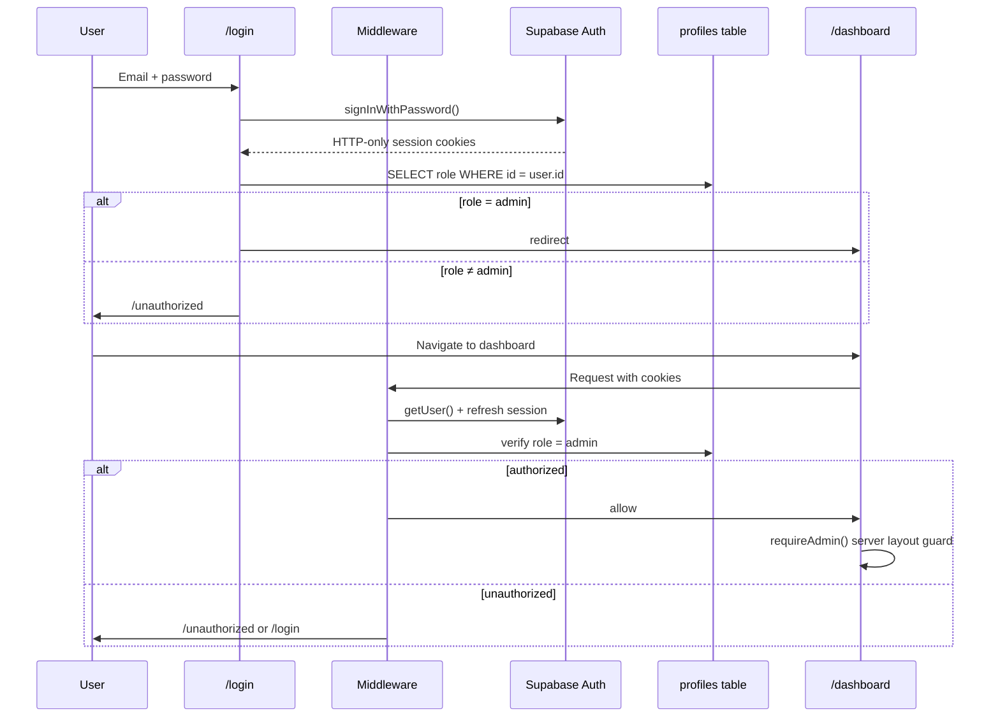

# Admin Dashboard — Authentication & Authorization

## Database Schema

### `profiles.role`

```sql
CREATE TYPE user_role AS ENUM ('admin', 'viewer');
ALTER TABLE profiles ADD COLUMN role user_role NOT NULL DEFAULT 'viewer';
```

| Role | Access |
|------|--------|
| `admin` | Full CMS dashboard + all mutations |
| `viewer` | Public site only (default for new signups) |

### Promote first admin

```sql
UPDATE profiles SET role = 'admin' WHERE email = 'you@example.com';
```

### RLS helper

```sql
CREATE FUNCTION is_admin() RETURNS BOOLEAN AS $$
  SELECT EXISTS (
    SELECT 1 FROM profiles WHERE id = auth.uid() AND role = 'admin'
  );
$$ LANGUAGE sql SECURITY DEFINER STABLE;
```

All CMS write policies use `is_admin()` — not merely `authenticated`.

---

## Middleware Architecture

```
Request → middleware.ts
            └── updateSession() [lib/supabase/middleware.ts]
                    ├── Refresh Supabase session cookies
                    ├── /dashboard/* + no user → /login?redirect=...
                    ├── /dashboard/* + user + role ≠ admin → /unauthorized
                    ├── /login + user + admin → /dashboard
                    ├── /login + user + non-admin → /unauthorized
                    └── /unauthorized + admin → /dashboard
```

**Matcher:** `/dashboard/:path*`, `/login`, `/unauthorized`

---

## Auth Flow Diagram



---

## Route Protection Strategy (Defense in Depth)

| Layer | Location | Purpose |
|-------|----------|---------|
| **1. Middleware** | `src/middleware.ts` | Block unauthenticated / non-admin before page render |
| **2. Layout guard** | `dashboard/layout.tsx` | `requireAdmin()` — server-side session + role check |
| **3. Page guard** | Each dashboard page | `await requireAdmin()` |
| **4. Server Actions** | `lib/actions/admin/*` | `assertAdmin()` on every mutation |
| **5. Database RLS** | PostgreSQL policies | `is_admin()` — last line of defense |

---

## Session Management

- **Storage:** HTTP-only cookies via `@supabase/ssr`
- **Refresh:** Middleware calls `getUser()` on every protected request
- **Sign out:** Server Action clears session → redirect `/login`
- **Client context:** `AuthProvider` for optional client-side state (public site)

---

## Server Actions

All mutations return `ActionResult<T>`:

```typescript
type ActionResult<T> =
  | { success: true; data: T }
  | { success: false; error: string };
```

Actions call `revalidatePath()` after successful mutations.

---

## Optimistic UI

Dashboard managers use `useOptimistic` + `useTransition`:

1. User action → immediate optimistic state update
2. Server Action executes
3. On error → `AlertBanner` shows message; page revalidates on next navigation

---

## Files Reference

| File | Role |
|------|------|
| `lib/auth/session.ts` | `getSession`, `requireAdmin` |
| `lib/actions/admin/guard.ts` | `assertAdmin` for mutations |
| `lib/supabase/middleware.ts` | Cookie refresh + route gates |
| `supabase/schema.sql` | Complete schema — tables, RLS, admin roles |
